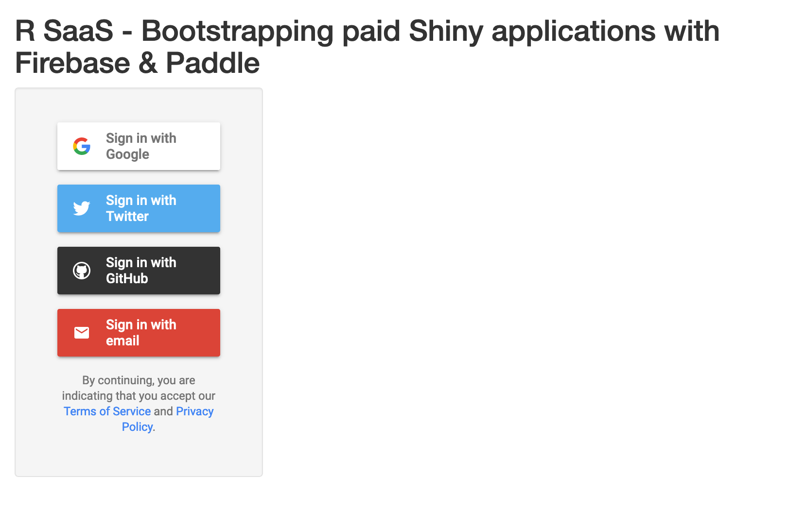
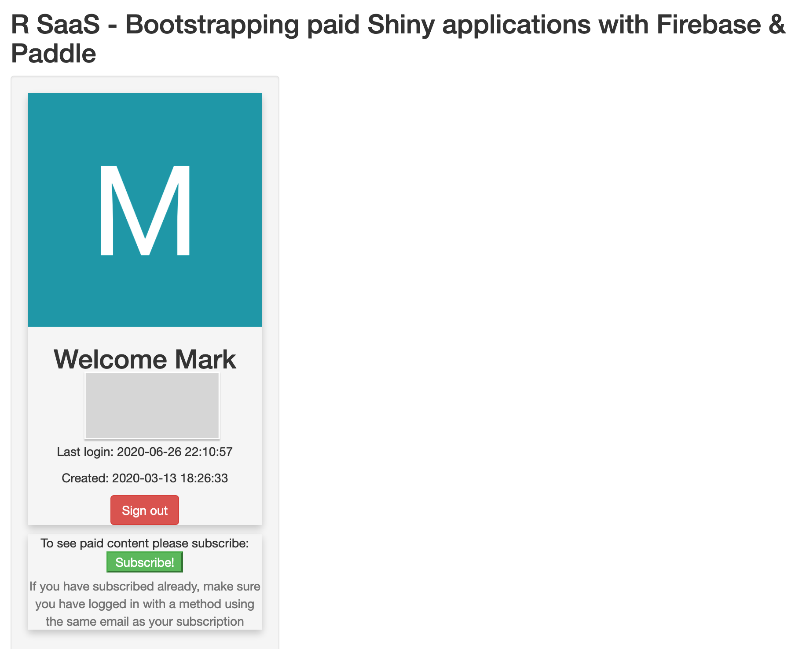
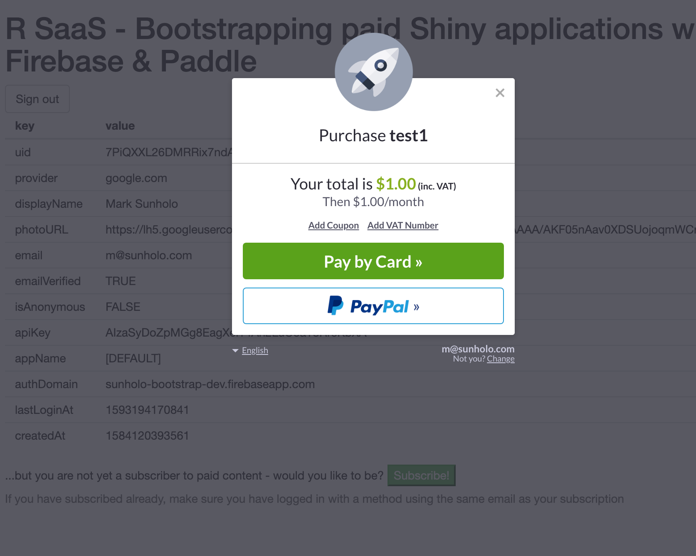
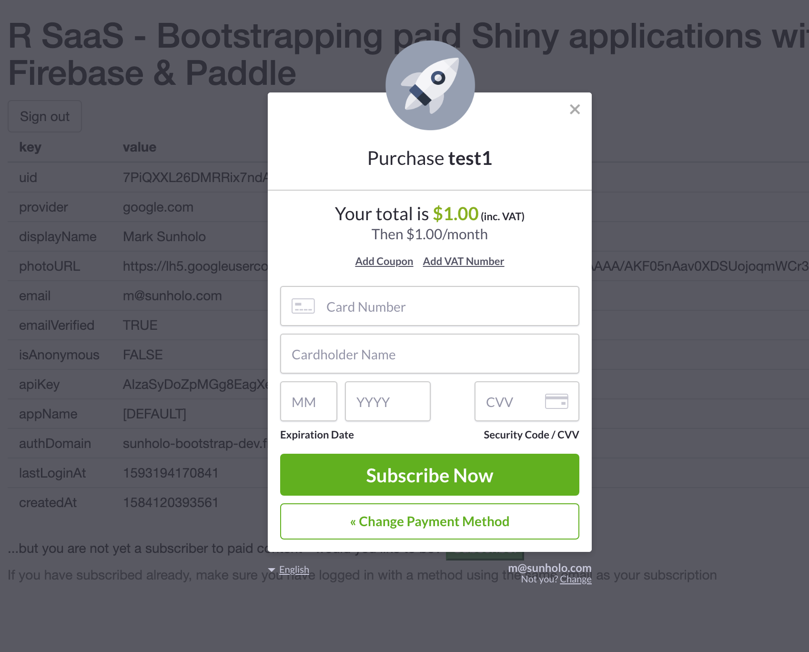
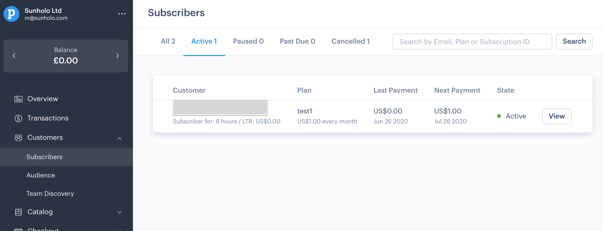
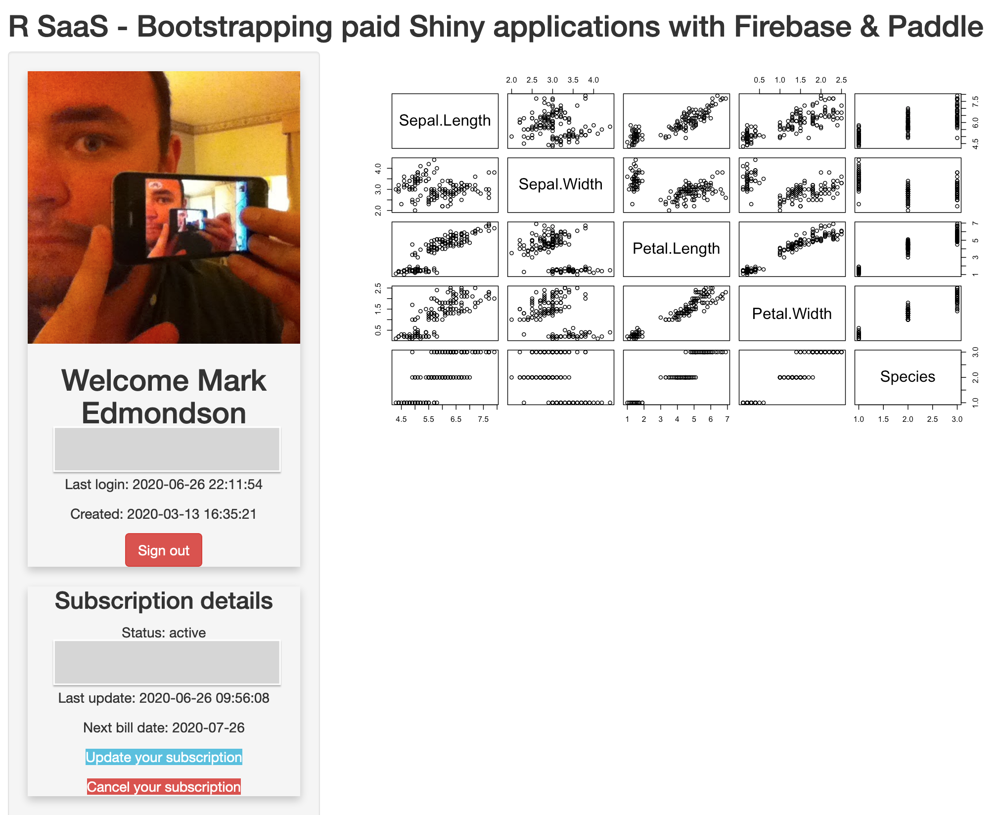
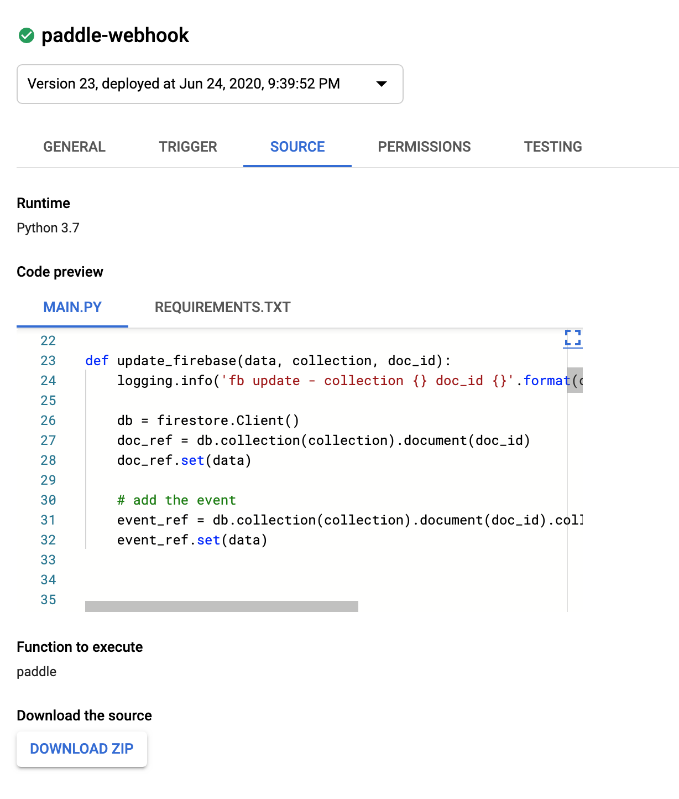

# Creating a paid R SaaS with Firebase, Paddle and Shiny

Create a template for R users to create paid subscription services for Shiny Apps.

## Demo

An example is deployed to shinyapps.io here:

https://mark.shinyapps.io/r-saas/

Login with one of the providers (more are available), use the coupon code "test123" to test the paid subscription service of Paddle.  The paid content is a woeful plot.

## Many thanks to...

This project is derived from:

* https://www.tychobra.com/posts/2019-01-03-firebasse-auth-wtih-shiny/
* Firebase [AuthUI](https://firebaseopensource.com/projects/firebase/firebaseui-web/)
* An early iteration inspired some of this package https://github.com/JohnCoene/firebase which it now uses for firebase auth
* Some guy on medium.com who did the cloud function in PHP but I can't find it now

## Screenshots

* Firebase auth on login - select which services to support in Firebase UI



* Once you login but have not subscribed yet - Paddle creates a login button



* Paddle takes care of subscription and credit card details




* Subscription appears in Paddle UI



* If a paid subscriber already - see the great Shiny content



* User authentication and payment history kept in a Firebase Auth and Firestore


* Sync between Paddle and Firebase uses a Google Cloud Function in Python3.7



## Payment strategy

A diagram on how the app handles payments


## Steps to have working demo bootstrap

1. Download or clone this repository
2. Create a [Firebase](https://firebase.google.com/) account and setup as per https://firebase.john-coene.com/articles/get-started.html - get your firebase API key and project-id
3. Create a [Paddle](https://paddle.com) account and [setup](https://developer.paddle.com/getting-started/intro) and get your [Paddle Vendor Id](https://vendors.paddle.com/authentication) and create a test catalog [subscription plan to get a Paddle Plan Id](https://vendors.paddle.com/subscriptions/plans).  Its helpful to also create [a coupon](https://vendors.paddle.com/coupons) with 100% discount for testing. 
4. Download a [clientId JSON file for your GCP project](https://console.cloud.google.com/apis/credentials/oauthclient) (same as Firebase project), application type "Desktop app"
5. Create env args via `.Renviron` or otherwise:

```
FIREBASE_API_KEY=your-api-key
FIREBASE_PROJECT=your-firebase-project
GAR_CLIENT_JSON=file-location-of-client-id
PADDLE_VENDOR=paddle-vendor-id
```

6. When you create a Paddle subscription it gives you a productId - this should be unique for each Shiny app and is placed at the top of server.R in the `PADDLE_PRODUCT_ID` global arg.
7. Deploy the Cloud Function in `payment_app/fb_functions` in the same Firebase project via the GCP console.  This handles communication between Firebase and Paddle webhooks.
8. Create a firebase client auth key with "roles/datastore.viewer" role - with googleAuthR this can be done via:

```r
library(googleAuthR)

# creates firebase-reader-auth-key.json file
gar_service_provision("firebase-reader", "roles/datastore.viewer")
```
9. Run the Shiny app on `http://localhost:PORT` to test locally (`http://127.0.0.1:PORT` doesn't work with Firebase login) - I launch Shiny in Viewer pane then visit `http://localhost` in my browser
10. Deploy the test Shiny app in `shiny/` with the client auth key in the same folder


## Running the payment app

The Shiny App will offer to link to the payment popup via Paddle after login with Firebase Auth.  The firebase auth ID is used to verify if the user has an existing subscription, and if not creates a payment button to do so.  If a user does have a subscription, then they see the paid content. 

If a subscription fails (the credit card is cacnelled or similar) then Paddle updates.

The Firebase databsae "subscriptions" is used to keep track of whether a user has paid or not.  The communication between Firebase and PAddle is done via the Python cloud function in the `payment_app/` folder - see its [README for details](https://github.com/MarkEdmondson1234/Shiny-R-SaaS/tree/master/payment_app).


